# 🛠️ Homelab Blueprint

> **Mirror Status:** Mirrored across [Codeberg](https://codeberg.org/gravi-ctrl/homelab-blueprint) (Primary) and [GitHub](https://github.com/gravi-ctrl/homelab-blueprint).

This repository functions as the automation engine for my Debian home server. It acts as a self-documenting "Source of Truth" handling everything from SSL/Proxy provisioning to high-resilience backups and real-time Telegram observability.

**Location on Server:** `~/scripts`

---

## 📊 System Maps
Auto-generated every morning at 05:00:

- **[📜 Script Inventory](./SCRIPTS_INVENTORY.md)** — every script, its purpose, and run frequency
- **[📅 Automation Schedule](./CRON_SCHEDULE.md)** — full cron schedule in human-readable form

---

## ⚙️ How it Works

### Telegram Alerts [[cron-guard.py](./cron-guard.py)]
Almost every cron job is wrapped in this script to: 
- Send a Telegram message with the last 15 lines of logs whenever a job finishes. 
- Notify me on "Always", "Only on Failure", or "Only on Success".

### SSL & NPM [[cert-manager.sh](./cert-manager/cert-manager.sh)]
This manages my local SSL certificates and Nginx Proxy Manager.
- Adding a service automatically generates the SSL cert and creates the Proxy Host in NPM via API.
- It also exports the Root CA to a Syncthing folder so I can easily install it on my phone or laptop.

### Daily Sync [[backup-scripts-git.sh](./backup-scripts-git.sh)]
At 05:00 every day, the server:
- Snapshots my installed package list, PPAs, and crontabs.
- Re-indexes all scripts and translates the cron schedule into Markdown.
- Commits and pushes all changes to my Git mirrors using [[git-auto-sync.py](./git-auto-sync.py)].

### Safety & Integrity
- **Backups:** [[local-opt-backup.sh](./local-opt-backup.sh)] stops the Docker socket during backups to ensure data isn't being written mid-snapshot. It verifies the archive integrity before finishing. This creates the `docker-stacks-DATE.tar.zst.age` backup file.
- **Nextcloud:** [[nextcloud-dynamic-watch.sh](./nextcloud-dynamic-watch.sh)] watches my data folders and tells Nextcloud to scan for new files the moment they are added.
- **Hardware:** [[battery_monitor.sh](./battery_monitor.sh)] shuts down the server if the battery is low, and [[fix-cpu-thermals.sh](./run_once/fix-cpu-thermals.sh)] keeps the CPU from overheating.

> [!TIP]
> For a deeper look at the entire stack, refer to the **[Script Inventory](./SCRIPTS_INVENTORY.md)** and **[Automation Schedule](./CRON_SCHEDULE.md)** under the **System Maps** section.
---

## 🚨 Disaster Recovery

```mermaid
graph TD
    A[Encrypted Backup + Key] --> B[Phase 1: bootstrap.sh]
    B --> C[Phase 2: setup.sh]
    C --> D{Ghost Watcher}
    D -->|Wait for Container| E[Auto-Config Nextcloud/Tailscale]
    E --> F[Phase 3: Finalize & Reboot]
    F --> G((Server Online))

    style A fill:#1f242b,stroke:#d29922
    style B fill:#1f242b,stroke:#3081f7
    style C fill:#1f242b,stroke:#3081f7
    style D fill:#1f242b,stroke:#3fb950
    style G fill:#1f242b,stroke:#3fb950
```



The weekly `docker-stacks-DATE.tar.zst.age` backup contains everything needed:

| Path | What |
|------|------|
| `~/scripts` | This repository (Automation Engine) |
| `/opt/stacks` | [Docker Stacks](https://codeberg.org/gravi-ctrl/server-docker-backup) (Compose files & secrets) |
| `~/ctrl-s-master` | [Credential Archival Engine](https://codeberg.org/gravi-ctrl/ctrl-s-master) |
| `~/.ssh` | Deploy keys |
| `/etc/ssh` | Host keys |

---

### Phase 1 — Bootstrap
**1. Setup Decryption Key:**
```bash
sudo nano /root/.backup-key.txt  # Paste your age key
sudo chmod 600 /root/.backup-key.txt
```

**2. Run Bootstrap:**
> [!IMPORTANT]
> The bootstrap script expects the backup archive to be located in `$HOME`. Ensure your `docker-stacks-*.tar.zst.age` file is copied there before proceeding.
```bash
curl -fsSL codeberg.org/gravi-ctrl/homelab-blueprint/raw/bootstrap.sh | bash
```
*This decrypts the backup, restores the filesystem, fixes SSH permissions, and once done, removes the backup file.*

<details>
<summary><b>No backup❓ Click here to start from scratch</b></summary>

> [!NOTE]
> **Manual Setup:** If you are starting from scratch without a backup archive:
> ```bash
> # Place SSH keys from password manager into ~/.ssh/
> chmod 700 ~/.ssh && chmod 600 ~/.ssh/id_* && chmod 644 ~/.ssh/id_*.pub
>
> git clone git@codeberg.org:gravi-ctrl/homelab-blueprint.git ~/scripts
> find ~/scripts -type f \( -name "*.sh" -o -name "*.py" \) -exec chmod +x {} +
>
> find ~/scripts -type f -name ".env.example" -execdir cp --update=none .env.example .env \;
> cp --update=none ~/scripts/dockcheck/default.config ~/scripts/dockcheck/dockcheck.config
> ```
</details>

**3.** Run the installer:
```bash
~/scripts/run_once/setup.sh
```
*This installs Docker, firewall, directory structure, permissions, Unbound, dotfiles, crontabs. Installs a background watcher that auto-configures containers as they come up.*

---

### Phase 2 — Docker Stacks

Restore the stacks using the compose files already placed in `/opt/stacks`:

```bash
# Start Dockge to manage stacks via UI
cd /opt/stacks/dockge && docker compose up -d

# Or bring up everything at once
find /opt/stacks -maxdepth 2 -name "compose.yml" -execdir docker compose up -d \;
```

<details>
<summary><b>No backup❓ Click here to start from scratch</b></summary>

> [!NOTE]
> **Manual Setup:** If you didn't have a stacks archive, clone the repo and populate new `.env` files:
> ```bash
> sudo mkdir -p /opt/stacks && sudo chown -R $(id -u):$(id -g) /opt/stacks
> git clone git@codeberg.org:gravi-ctrl/server-docker-backup.git /opt/stacks
>
> # New secrets only - as configs at this point are... well, gone
> for d in /opt/stacks/*/; do [ -f "${d}.env.example" ] && cp --update=none "${d}.env.example" "${d}.env"; done
> ```
</details>

---

### Phase 3 — Finalize

The background watcher handles most post-restore tasks automatically.

> [!WARNING]
> Critical manual steps remaining:
> - **Borgmatic:** Mount external HDD, import key, and run a check:
>    `borg key import /mnt/external_hdd/borg-repo ~/borg-key-backup.txt && borgmatic check`
> - **Tailscale:** If connection fails, regenerate auth key at [Tailscale Admin](https://login.tailscale.com/admin/settings/keys) with Reusable + Tags, then update `TS_AUTHKEY` in `/opt/stacks/tailscale/.env`

**Finally:** `sudo reboot`

---


## 🔄 Dual-push mirror setup

```bash
git remote set-url --add --push origin git@codeberg.org:gravi-ctrl/homelab-blueprint.git
git remote set-url --add --push origin git@github.com:gravi-ctrl/homelab-blueprint.git
git remote -v
```