```mermaid
graph TD
    %% Main Path
    A[Encrypted Backup + Key] --> B[Phase 1: bootstrap.sh]
    B --> C[Phase 2: setup.sh]
    
    %% The Spawning of the Ghost
    C -- spawns --> GW[<i>Ghost Watcher Daemon</i>]
    
    C --> D[<b>Phase 3: Manual Reboot</b>]
    D --> E[Spin up Docker Stacks]
    E --> F((<b>Server Online</b>))

    %% The Background Path
    GW -.->|Monitoring| E
    E -.->|Watched containers online| G[Run Post-Start Tasks]
    G -.->|Notify via Telegram| H[<b>Self Destruct</b>]

    %% Styling
    style GW fill:#1f242b,stroke:#8b5cf6,stroke-dasharray: 5 5
    style H fill:#1f242b,stroke:#ef4444
    style F fill:#1f242b,stroke:#3fb950
    style B fill:#1f242b,stroke:#3081f7
    style C fill:#1f242b,stroke:#3081f7
```

# 🛠️ Homelab Blueprint

> **Mirror Status:** Mirrored across [Codeberg](https://codeberg.org/gravi-ctrl/homelab-blueprint) (Primary) and [GitHub](https://github.com/gravi-ctrl/homelab-blueprint).

This repository functions as the automation engine for my Debian home server. It acts as a self-documenting "Source of Truth" handling everything from SSL/Proxy provisioning to high-resilience backups and real-time Telegram observability.

**Location on Server:** `~/scripts`

---

## 📊 System Maps
Auto-generated every morning at 05:00:

- **[📜 Script Inventory](./SCRIPTS_INVENTORY.md)** — every script, its purpose, and run frequency
- **[📅 Automation Schedule](./CRON_SCHEDULE.md)** — full cron schedule in human-readable form

---

## ⚙️ How it Works

The server manages its own SSL certificates, issues them via a local CA, and deploys them to the reverse proxy automatically. Scheduled tasks run through a Telegram wrapper, so failures are never silent. The server snapshots its own state daily - scripts, crontabs, package lists - and commits everything to Git. Once a week, a verified age-encrypted archive captures the entire stack, ready to restore a wiped machine in under an hour.

The result: the server largely runs itself, and when something does go wrong, you already know about it before you notice.

> [!TIP]
> For the full picture, see the **[Script Inventory](./SCRIPTS_INVENTORY.md)** and **[Automation Schedule](./CRON_SCHEDULE.md)**.

---

## 🚨 Disaster Recovery



The weekly `docker-stacks-DATE.tar.zst.age` backup contains everything needed:

| Path | What |
|------|------|
| `~/scripts` | This repository (Automation Engine) |
| `/opt/stacks` | [Docker Stacks](https://codeberg.org/gravi-ctrl/server-docker-backup) (Compose files & secrets) |
| `~/ctrl-s-master` | [Credential Archival Engine](https://codeberg.org/gravi-ctrl/ctrl-s-master) |
| `~/.ssh` | Deploy keys |
| `/etc/ssh` | Host keys |

---

### Phase 1 — Bootstrap

**1. Setup Decryption Key:**
```bash
# Paste your age key
sudo nano /root/.backup-key.txt
sudo chmod 600 /root/.backup-key.txt
```

**2. Run Bootstrap:**
> [!IMPORTANT]
> The bootstrap script expects the backup archive to be located in `$HOME`. Ensure your `docker-stacks-*.tar.zst.age` file is copied there before proceeding.
```bash
curl -fsSL github.com/gravi-ctrl/homelab-blueprint/raw/main/bootstrap.sh | bash
```
*This decrypts the backup, restores the filesystem, fixes SSH permissions, and once done, removes the backup file.*

<details>
<summary><b>No backup❓ Click here to start from scratch</b></summary>

> [!NOTE]
> **Manual Setup:** If you are starting from scratch without a backup archive:
> ```bash
> # Place SSH keys from password manager into ~/.ssh/
> chmod 700 ~/.ssh && chmod 600 ~/.ssh/id_* && chmod 644 ~/.ssh/id_*.pub
>
> git clone git@codeberg.org:gravi-ctrl/homelab-blueprint.git ~/scripts
> find ~/scripts -type f \( -name "*.sh" -o -name "*.py" \) -exec chmod +x {} +
>
> find ~/scripts -type f -name ".env.example" -execdir cp --update=none .env.example .env \;
> cp --update=none ~/scripts/dockcheck/default.config ~/scripts/dockcheck/dockcheck.config
> ```
</details>

---

### Phase 2 — System Provisioning

Run the main installer:
```bash
~/scripts/run_once/setup.sh
```
*This installs Docker, firewall, directory structure, Python libraries, Unbound DNS, ZSH, and restores your system configs (crontabs, hosts, etc).*

*At the end, it spawns the **Ghost Watcher**—a background service that waits for containers to come online and runs their post-start configuration tasks automatically.*

---

### Phase 3 — Docker & Finalize

**1. Reboot the Server:**
```bash
sudo reboot
```

**2. Restore the Stacks:**
After rebooting, move to `/opt/stacks` and bring up your services.

```bash
# Start Dockge to manage stacks via UI
cd /opt/stacks/dockge && docker compose up -d

# Or bring up everything at once
find /opt/stacks -maxdepth 2 -name "compose.yml" -execdir docker compose up -d \;
```

> [!TIP]
> **The Ghost Watcher in Action:** As soon as you run `docker compose up`, the Ghost Watcher detects containers coming online, runs their post-start tasks, sends a Telegram confirmation, and deletes itself.

<details>
<summary><b>No backup❓ Click here to start from scratch</b></summary>

> [!NOTE]
> **Manual Setup:** If you didn't have a stacks archive, clone the repo and populate new `.env` files:
> ```bash
> sudo mkdir -p /opt/stacks && sudo chown -R $(id -u):$(id -g) /opt/stacks
> git clone git@codeberg.org:gravi-ctrl/server-docker-backup.git /opt/stacks
>
> # New secrets only - as configs at this point are... well, gone
> for d in /opt/stacks/*/; do [ -f "${d}.env.example" ] && cp --update=none "${d}.env.example" "${d}.env"; done
> ```
</details>

<br>

> [!WARNING]
> **Critical manual steps remaining:**
> - **Borgmatic:** Mount external HDD, import key, and run a check:
>    `borg key import /mnt/external_hdd/borg-repo ~/borg-key-backup.txt && borgmatic check`
> - **Tailscale:** If the Tailscale Funnel connection fails, regenerate the auth key at [Tailscale Admin](https://login.tailscale.com/admin/settings/keys) (Reusable + Tags), then update `TS_AUTHKEY` in `/opt/stacks/tailscale/.env`

---

## 🔄 Dual-push mirror setup

```bash
git remote set-url --add --push origin git@codeberg.org:gravi-ctrl/homelab-blueprint.git
git remote set-url --add --push origin git@github.com:gravi-ctrl/homelab-blueprint.git
git remote -v
```