# 🛠️ Homelab Blueprint

> **Mirror Status:** Mirrored across [Codeberg](https://codeberg.org/gravi-ctrl/homelab-blueprint) (Primary) and [GitHub](https://github.com/gravi-ctrl/homelab-blueprint).

This repository functions as the automation engine for my Debian home server. It acts as a self-documenting "Source of Truth" handling everything from SSL/Proxy provisioning to high-resilience backups and real-time Telegram observability.

**Location on Server:** `~/scripts`

---

## 📊 System Maps
Auto-generated every morning at 05:00:

- **[📜 Script Inventory](./SCRIPTS_INVENTORY.md)** — every script, its purpose, run frequency, and what it needs to run
- **[📅 Automation Schedule](./CRON_SCHEDULE.md)** — full cron schedule, at-a-glance overview, and configuration reference

---

## ⚙️ How it Works

The server manages its own SSL certificates, issues them via a local CA, and deploys them to the reverse proxy automatically. Scheduled tasks run through a Telegram wrapper, so failures are never silent. The server snapshots its own state daily - scripts, crontabs, package lists - and commits everything to Git. Once a week, a verified age-encrypted archive captures the entire stack, ready to restore a wiped machine in under an hour.

The result: the server largely runs itself, and when something does go wrong, you already know about it before you notice.

> [!TIP]
> For the full picture, see the **[Script Inventory](./SCRIPTS_INVENTORY.md)** and **[Automation Schedule](./CRON_SCHEDULE.md)**.

---

## 🚨 Deployment & Recovery

```mermaid
graph TD
    %% Main Path
    A[Encrypted Backup + Key] --> B[Phase 1: bootstrap.sh]
    B --> C[Phase 2: setup.sh]
    
    %% The Spawning of the Ghost
    C -- spawns --> GW[<i>Ghost Watcher Daemon</i>]
    
    C --> D[<b>Phase 3: Manual Reboot</b>]
    D --> E[Spin up Docker Stacks]
    E --> F((<b>Server Online</b>))

    %% The Background Path
    GW -.->|Monitoring| E
    E -.->|Watched containers online| G[Run Post-Start Tasks]
    G -.->|Notify via Telegram| H[<b>Self Destruct</b>]

    %% Styling
    style GW fill:#1f242b,stroke:#8b5cf6,stroke-dasharray: 5 5
    style H fill:#1f242b,stroke:#ef4444
    style F fill:#1f242b,stroke:#3fb950
    style B fill:#1f242b,stroke:#3081f7
    style C fill:#1f242b,stroke:#3081f7
```



The server can be provisioned in two ways: **Full Recovery** (restoring a weekly `docker-stacks-DATE.tar.zst.age` archive) or a **Fresh Start** (bootstrapping from scratch). 

A full backup archive contains everything needed to restore the exact state:

| Path | What |
|------|------|
| `~/scripts` | This repository (Automation Engine) |
| `/opt/stacks` | [Docker Stacks](https://codeberg.org/gravi-ctrl/server-docker-backup) (Compose files & secrets) |
| `~/ctrl_s_master` | [Credential Archival Engine](https://codeberg.org/gravi-ctrl/ctrl-s-master) |
| `~/.ssh` | Deploy keys |
| `/etc/ssh` | Host keys |
| `~/.local/share/mkcert` | Local CA for SSL |

---

### Phase 1 — Bootstrap

The bootstrap script is designed to handle both a **Full Recovery** (decrypts archive) and a **Fresh Start** (skips decryption, dynamically fetches repos).

**1. Preparation:**
Choose your scenario before running the script:

*   **Option A: Full Recovery**
    Ensure `docker-stacks-*.tar.zst.age` is in `$HOME`. Retrieve your age decryption key and paste it:
    ```bash
    sudo nano /root/.backup-key.txt
    sudo chmod 600 /root/.backup-key.txt
    ```
*   **Option B: Fresh Start (No Backup)**
    Simply place your Git deploy keys into `~/.ssh/` from your password manager.

**2. Verify and Run Bootstrap:**

For maximum supply-chain security, we verify the script's cryptographic hash before executing it as root.

1. Retrieve the **trusted SHA-256 hash** of `bootstrap.sh` from your password manager.
2. Run the command below, replacing `<paste_trusted_hash_here>` with your stored hash:

```bash
curl -fsSL codeberg.org/gravi-ctrl/homelab-blueprint/raw/bootstrap.sh -o /tmp/bootstrap.sh
# or if down
curl -fsSL github.com/gravi-ctrl/homelab-blueprint/raw/main/bootstrap.sh -o /tmp/bootstrap.sh

echo "<paste_trusted_hash_here> /tmp/bootstrap.sh" | sha256sum --check -
bash /tmp/bootstrap.sh
```
> [!NOTE]
> If doing a Fresh Start, the script will detect the missing key and ask if you want to skip the backup restoration. Press `y`. It will then initialize your environment and automatically clone all necessary Git repositories.

<details>
<summary><b>Fresh Start Only: Initialize .env files</b></summary>

> Since you skipped the backup, your configurations are missing. Fill in your secrets:
> ```bash
> find ~/scripts -type f -name ".env.example" -execdir cp --update=none .env.example .env \;
> ```
</details>

---

### Phase 2 — System Provisioning

Run the main installer:
```bash
~/scripts/run_once/setup.sh
```
*This installs Docker, firewall, directory structure, Python libraries, Unbound DNS, ZSH, and restores your system configs (crontabs, hosts, etc).*

At the end, it spawns the **Ghost Watcher** (`container-watcher.sh`), a background service that waits for containers to come online and runs their post-start configuration tasks.

> [!NOTE]
> **The Ghost Watcher Engine:**
> The watcher is fully modular and controlled via `WATCHER_TASKS` in `/opt/scripts/.env`. You do not need to modify the engine to add new containers; simply define the payload function and add the container's name to the `.env` registry. Once all tasks complete, the daemon deletes its state file and self-destructs.

---

### Phase 3 — Docker & Finalize

**1. Reboot the Server:**
```bash
sudo reboot
```

<details>
<summary><b>Fresh Start Only: Initialize Stack Secrets</b></summary>

> Since you started fresh, `/opt/stacks` lacks its `.env` files. 
> Generate the templates first:
> ```bash
> for d in /opt/stacks/*/; do [ -f "${d}.env.example" ] && cp --update=none "${d}.env.example" "${d}.env"; done
> ```
> Fill in what you can from your password manager. Some secrets (e.g. OIDC client credentials) can only be obtained after spinning up their respective services first.

</details>

**2. Restore the Stacks:**
Move to `/opt/stacks` and spin up your infrastructure.

```bash
# Start Dockge to manage stacks via UI
cd /opt/stacks/dockge && docker compose up -d

# Or bring up everything at once
find /opt/stacks -maxdepth 2 -name "compose.yml" -execdir docker compose up -d \;
```

> [!TIP]
> **The Ghost Watcher in Action:** As soon as you run `docker compose up -d`, the Ghost Watcher detects containers coming online, executes their internal readiness checks, runs their post-start scripts, sends a Telegram confirmation, and silently uninstalls itself from systemd.

---

## 🔄 Dual-push mirror setup

```bash
git remote set-url --add --push origin git@codeberg.org:gravi-ctrl/homelab-blueprint.git
git remote set-url --add --push origin git@github.com:gravi-ctrl/homelab-blueprint.git
git remote -v
```
